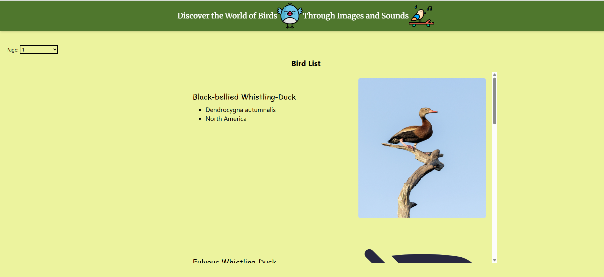
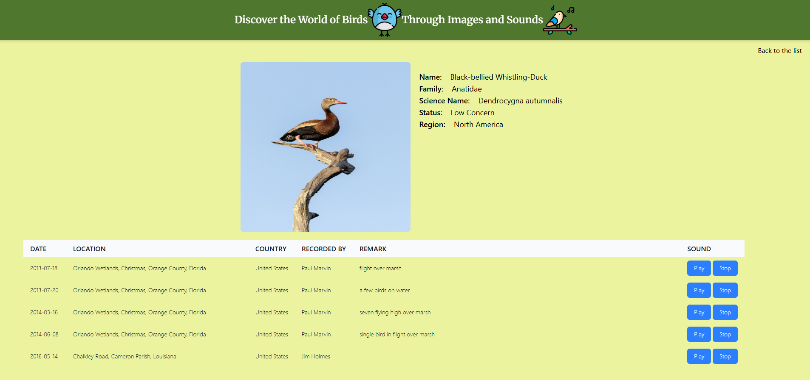

Home page:


Bird Detail Page:


# Bird Explorer

Bird Explorer is a web application that allows users to explore various bird species through images and sounds. It fetches data from an external API and displays a paginated list of birds with interactive features.

## Features

..* Fetch and display bird species with images and scientific names.
..* Play and stop bird sounds with an intuitive UI.
..* Implement pagination to browse through multiple pages of bird data.
..* Styled using Tailwind CSS for a clean and responsive UI.

## Installation
1. Clone the repository:
```javascript
git clone https://github.com/JeevithaPugazh/SBA308A.git
```
2. Navigate to the project directory:
```javascript
cd SBA308A
```
3. Install dependencies (if using a package manager like npm):
```javascript
npm install
```
4. If using Tailwind CSS locally, ensure it is properly configured.

## Usage
1. Start a local server:
```javascript
npm run dev
```
or open index.html directly in a browser.
2. Click the bird image to see the discription
3. Click on the play button to listen to the bird sound.

## API Reference
This project uses the Nuthatch Birds API:
..* Base URL: https://nuthatch.lastelm.software/v2/birds

..* Example request to get bird:
```javascript
axios.get('https://nuthatch.lastelm.software/v2/birds', {
  params: { page: 1, pageSize: 5, operator: 'AND' },
  headers: { 'API-Key': 'your-api-key' }
})
.then(response => console.log(response.data))
.catch(error => console.error(error));
``` 